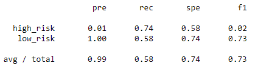
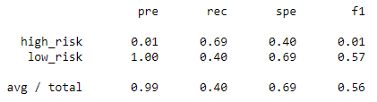
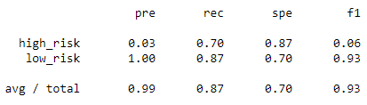
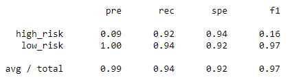

# Credit Risk Analysis

## Overview

This analysis is to compare the effectiveness of various supervised machine learning models in determining credit risk.  The data used is a credit card credit dataset from LendingClub, a peer-to-peer lending services company.  The models used for sampling were:
- Native Random Oversampling
- SMOTE Oversampling
- Cluster Centroid Sampling
- SMOTEEN samping
- Balanced Random Forest Classifier
- Easy Ensemble AdaBoost Classifier

## Results
- Balanced Accurary Scores, Precision and Recall of all six models
- [Screenshots]

### Native Random Oversampling
Balanced Accurary Score: 0.6603423204808787

### SMOTE
Balanced Accuracy Score: 0.6537310478007576
![ClassificationReport](images/SMOTE.png

### Cluster Centroids
Balanced Accruary Score: 0.5447339051023905

### SMOTEEN
Balanced Accuracy Score: 0.6447993752836463
![ClassificationReport](images/SMOTEEN.png

### Balanced Random Forest Classifier
Balanced Accuracy Score: 0.7885466545953005

### Easy Ensemble AdaBoost Classifier
Balanced Accuracy Score: 0.9316600714093861

## Summary
Recommendation on model to use or not to use any.
